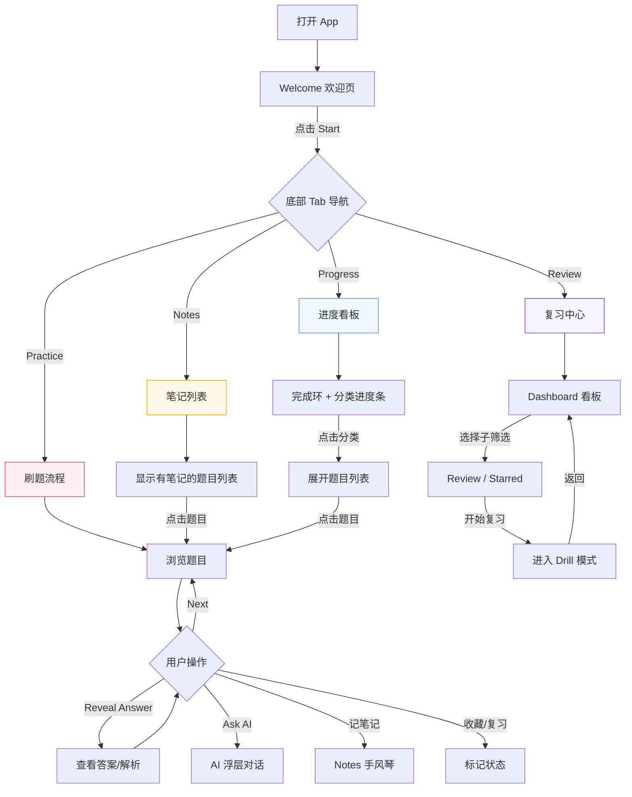
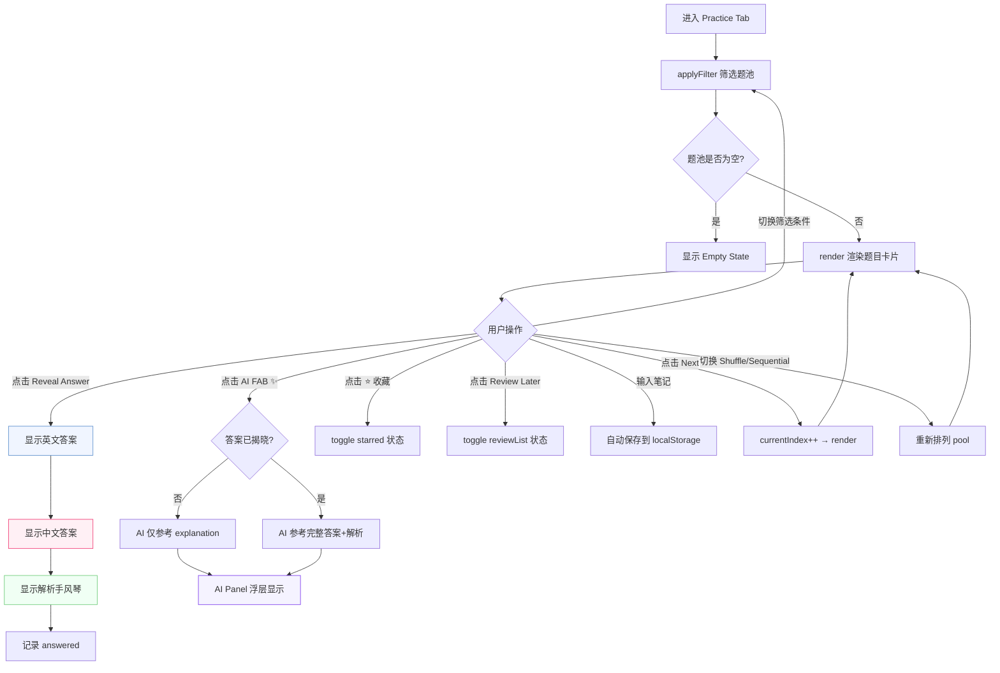
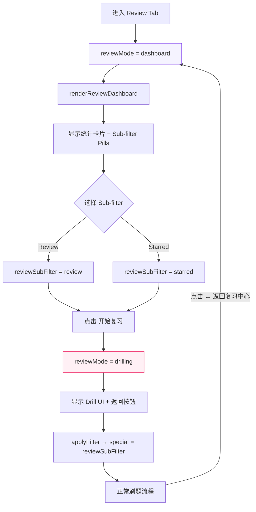
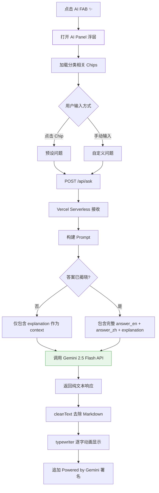
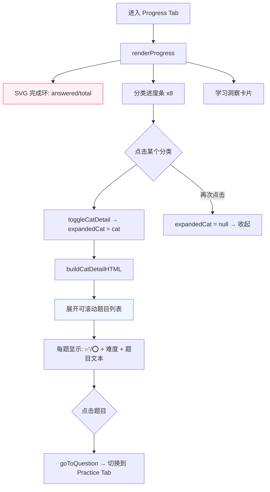
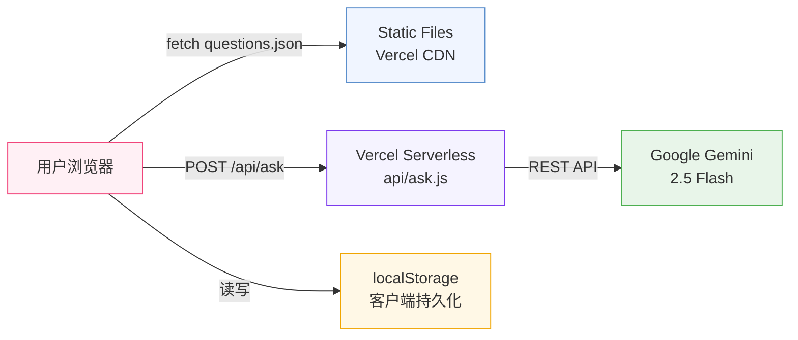

# IB Drill — 产品需求文档 (PRD)

> **一句话总结：** IB Drill 是一款移动端优先的投行技术面试刷题 App，内置 160 道中英双语题目、AI 实时辅导和个人化学习追踪，帮助候选人系统性地准备 Investment Banking 技术面试。

---

## 目录

- [1. 背景与目标](#1-背景与目标)
- [2. 用户画像](#2-用户画像)
- [3. 功能流程图](#3-功能流程图)
- [4. 需求列表](#4-需求列表)
- [5. 需求详述](#5-需求详述)
- [6. 设计系统规范](#6-设计系统规范)
- [7. 技术架构](#7-技术架构)
- [8. 题库结构](#8-题库结构)
- [9. 上线后统计计划](#9-上线后统计计划)

---

## 1. 背景与目标

### 1.1 产品背景

Investment Banking 技术面试覆盖 Accounting、Valuation、M&A、LBO 等多个核心领域，候选人面临以下痛点：

| 痛点 | 描述 |
|------|------|
| **题目分散** | 面试题散落在 PDF、论坛、Excel 中，缺乏系统化工具 |
| **缺乏即时反馈** | 刷题后没有 AI 辅导或上下文提示，只能死记硬背 |
| **无法追踪进度** | 不知道哪些题做过、哪些薄弱、哪些收藏了 |
| **中英文割裂** | 英文答案看不懂、中文解析找不到，两套资料来回切换 |

### 1.2 业务目标

| 目标 | 衡量指标 |
|------|---------|
| 帮助候选人系统性刷题 | 题库覆盖 8 大分类、160+ 道题 |
| 提供即时 AI 辅导 | 每道题均可一键 Ask AI，上下文感知 |
| 追踪学习进度 | 收藏、复习、已答、笔记四维追踪 |
| 移动端友好 | 手机上随时随地刷题，支持 iPhone safe area |

### 1.3 成功指标

- **题库完整度**：8 个分类均有 ≥15 道题
- **答题完成率**：用户平均完成 ≥60% 题目
- **AI 使用率**：≥30% 的答题触发 AI 对话
- **复访率**：7 日复访率 ≥40%

---

## 2. 用户画像

| 属性 | 描述 |
|------|------|
| **身份** | 准备 IB 面试的大学生 / 研究生 / 跳槽候选人 |
| **场景** | 通勤路上、课间、睡前碎片化刷题 |
| **设备** | 以手机为主（iOS/Android），兼顾桌面浏览器 |
| **语言** | 中英双语能力，英文答题、中文理解 |
| **核心诉求** | 快速过题 → 标记薄弱 → AI 辅助理解 → 追踪进度 |

---

## 3. 功能流程图

### 3.1 整体用户旅程



### 3.2 Practice 刷题流程



### 3.3 Review 复习流程



### 3.4 AI 问答流程



### 3.5 Progress 进度流程



---

## 4. 需求列表

### 4.1 Practice 模块

| 编号 | 功能 | 优先级 | 状态 |
|------|------|--------|------|
| P-01 | 题目卡片展示（分类、难度、ID、题目文本） | P0 | ✅ 已上线 |
| P-02 | Reveal Answer 揭晓答案（EN/ZH/解析） | P0 | ✅ 已上线 |
| P-03 | 解析手风琴展开/收起 | P0 | ✅ 已上线 |
| P-04 | 解析分段渲染（📋考什么 📝逻辑 ⚠️常见错误 💡提示） | P1 | ✅ 已上线 |
| P-05 | Next 按钮切换下一题 | P0 | ✅ 已上线 |
| P-06 | Shuffle / Sequential 模式切换 | P1 | ✅ 已上线 |
| P-07 | Category 分类筛选（8 分类） | P0 | ✅ 已上线 |
| P-08 | Difficulty 难度筛选 | P1 | ✅ 已上线 |
| P-09 | Special 特殊筛选（All / Starred / Review） | P1 | ✅ 已上线 |
| P-10 | 全文搜索（题目 + 答案 + 解析） | P1 | ✅ 已上线 |
| P-11 | 收藏 ⭐ 标记 | P0 | ✅ 已上线 |
| P-12 | Review Later 标记 | P0 | ✅ 已上线 |
| P-13 | Header 实时统计（当前/总数、收藏数、复习数） | P1 | ✅ 已上线 |
| P-14 | 进度条（当前题号 / 题池总数） | P1 | ✅ 已上线 |

### 4.2 AI 模块

| 编号 | 功能 | 优先级 | 状态 |
|------|------|--------|------|
| AI-01 | AI FAB 悬浮球（右下角） | P0 | ✅ 已上线 |
| AI-02 | AI Panel 浮层弹窗 | P0 | ✅ 已上线 |
| AI-03 | 分类感知 Chip 预设问题 | P1 | ✅ 已上线 |
| AI-04 | 自定义输入问答 | P0 | ✅ 已上线 |
| AI-05 | 上下文感知（根据答案是否揭晓调整 Prompt） | P1 | ✅ 已上线 |
| AI-06 | Typewriter 逐字动画 | P2 | ✅ 已上线 |
| AI-07 | 回答来源署名 | P2 | ✅ 已上线 |

### 4.3 Review 模块

| 编号 | 功能 | 优先级 | 状态 |
|------|------|--------|------|
| R-01 | Review Dashboard 看板 | P0 | ✅ 已上线 |
| R-02 | 统计卡片（待复习数、收藏数） | P1 | ✅ 已上线 |
| R-03 | Sub-filter Pills（Review / Starred） | P1 | ✅ 已上线 |
| R-04 | 开始复习 → 进入 Drill 模式 | P0 | ✅ 已上线 |
| R-05 | 返回复习中心按钮 | P1 | ✅ 已上线 |

### 4.4 Notes 模块

| 编号 | 功能 | 优先级 | 状态 |
|------|------|--------|------|
| N-01 | 题目级笔记（手风琴展开 + 自动保存） | P0 | ✅ 已上线 |
| N-02 | Notes Tab 列表视图（显示所有有笔记的题目） | P1 | ✅ 已上线 |
| N-03 | 点击笔记条目 → 跳转到对应题目 | P1 | ✅ 已上线 |
| N-04 | 笔记预览（截取前 80 字符） | P2 | ✅ 已上线 |

### 4.5 Progress 模块

| 编号 | 功能 | 优先级 | 状态 |
|------|------|--------|------|
| PG-01 | SVG 完成环（总答题进度） | P0 | ✅ 已上线 |
| PG-02 | 分类进度条（8 分类各自完成率） | P0 | ✅ 已上线 |
| PG-03 | 分类点击展开题目列表 | P1 | ✅ 已上线 |
| PG-04 | 题目完成状态标记（✅/⭕） | P1 | ✅ 已上线 |
| PG-05 | 学习洞察卡片（收藏、待复习、笔记数） | P2 | ✅ 已上线 |

### 4.6 数据持久化

| 编号 | 功能 | 优先级 | 状态 |
|------|------|--------|------|
| D-01 | localStorage 收藏列表（ib_starred） | P0 | ✅ 已上线 |
| D-02 | localStorage 复习列表（ib_review） | P0 | ✅ 已上线 |
| D-03 | localStorage 已答列表（ib_answered） | P0 | ✅ 已上线 |
| D-04 | localStorage 题目笔记（ib_note_{id}） | P0 | ✅ 已上线 |

### 4.7 基础体验

| 编号 | 功能 | 优先级 | 状态 |
|------|------|--------|------|
| B-01 | Welcome 欢迎页 | P1 | ✅ 已上线 |
| B-02 | Tab Bar 底部导航（4 Tab） | P0 | ✅ 已上线 |
| B-03 | Empty State 空状态 | P1 | ✅ 已上线 |
| B-04 | iPhone safe-area 适配 | P1 | ✅ 已上线 |
| B-05 | 最大宽度 660px 居中容器 | P2 | ✅ 已上线 |

---

## 5. 需求详述

### 5.1 Welcome 欢迎页

| 属性 | 说明 |
|------|------|
| **展示逻辑** | App 加载完成后默认显示；点击 Start 后淡出消失，不再出现（当次会话内） |
| **标题文案** | 📚 IB Drill |
| **副标题** | Technical Interview Practice |
| **按钮文案** | Start |
| **交互** | 点击 Start → welcome 元素 `opacity: 0` → 350ms 后 `display: none` → 加载第一题 |

### 5.2 Header 头部统计

| 属性 | 说明 |
|------|------|
| **展示逻辑** | Practice Tab + Review Drill 模式下可见；其他 Tab 隐藏 |
| **内容** | 品牌区（📚 IB Drill + tagline）+ 统计区 + 模式指示器 + 进度条 |
| **统计区文案** | `[当前题号/题池总数] · ⭐ [收藏数] · ⭕ [复习数]` |
| **模式指示器** | 胶囊 Pill：`SHFL`（Shuffle）或 `SEQ`（Sequential） |
| **进度条** | 2px 白色线条，宽度 = `(currentIndex + 1) / pool.length * 100%`，`transition: 0.5s` |
| **刷新时机** | 每次 `render()` 调用时更新 |

### 5.3 Toolbar 工具栏

| 属性 | 说明 |
|------|------|
| **展示逻辑** | Practice Tab 完整显示；Review Drill 模式下显示但隐藏 Special 筛选器；其他 Tab 隐藏 |
| **搜索栏** | 🔍 图标 + input（placeholder: "Search questions..."）+ ✕ 清除按钮 |
| **搜索逻辑** | 搜索范围：`question` + `answer_en` + `answer_zh` + `explanation_zh`，实时筛选（每次输入触发 `applyFilter`） |
| **分类筛选** | `<select>` 下拉：`All Categories` + 8 个分类 |
| **难度筛选** | `<select>` 下拉：`All Levels` / `Easy` / `Medium` / `Hard` |
| **特殊筛选** | `<select>` 下拉：`All` / `⭐ Starred Only` / `🔄 Review List` |
| **模式切换** | 两个按钮：`⇲ Shuffle` / `→ Sequential`，当前激活项高亮（pink 背景） |
| **联动逻辑** | 任一筛选变化 → `applyFilter()` → 重建 `pool[]` → `render()` |

#### applyFilter 筛选逻辑

```
输入: QUESTIONS[] 全量题库
筛选链:
  1. category 不为 'all' → 过滤 q.category === category
  2. difficulty 不为 'all' → 过滤 q.difficulty === difficulty
  3. special:
     - 'starred' → 过滤 starred.includes(q.id)
     - 'review' → 过滤 reviewList.includes(q.id)
  4. search 非空 → 模糊匹配 question/answer_en/answer_zh/explanation_zh
  5. Review Tab drilling → 强制 special = reviewSubFilter
输出: pool[] → shuffle 或 sequential 排列 → render()
```

### 5.4 Question Card 题目卡片

| 属性 | 说明 |
|------|------|
| **展示逻辑** | 题池非空时显示 |
| **卡片头部** | 左：分类 Badge（蓝底白字 pill）+ 难度 Badge（颜色按难度）+ 题目 ID（灰色 monospace） |
| **收藏按钮** | 右上角 ⭐，已收藏时填充黄色 + 放大动画 |
| **卡片正文** | 题目文本，`font-size: 15px`，`line-height: 1.7` |
| **难度颜色** | Easy: `--grn`; Medium: `--amber`; Hard: `--pink` |

### 5.5 Answer Section 答案区

揭晓答案后依次出现三张卡片：

#### English Answer Card
| 属性 | 说明 |
|------|------|
| **标签** | `🔵 English Answer` |
| **左边框** | 3px `--blue` |
| **背景** | `--blue-lt` |
| **内容** | `current.answer_en` |

#### Chinese Answer Card
| 属性 | 说明 |
|------|------|
| **标签** | `🌸 中文答案` |
| **左边框** | 3px `--pink` |
| **背景** | `--pink-lt` |
| **内容** | `current.answer_zh` |

#### Explanation Card（手风琴）
| 属性 | 说明 |
|------|------|
| **标签** | `💡 解析` |
| **左边框** | 3px `--grn` |
| **默认状态** | 收起（`max-height: 0; overflow: hidden`） |
| **展开交互** | 点击标题行 → toggle `max-height` → chevron ▶ 旋转 90° |
| **内容解析** | 正则匹配 `【标签】` 分段，每段前置图标：📋=考什么, 📝=逻辑, ⚠️=易错, 💡=默认 |

### 5.6 Action Bar 操作栏

| 按钮 | 文案 | 样式 | 交互 |
|------|------|------|------|
| **Reveal** | 🌟 Reveal Answer | Pink 填充，full-width → 揭晓后隐藏 | 显示答案区 + 记录 answered |
| **Review** | 📋 Review Later | Outline 边框 → 标记后 Amber 填充 | Toggle reviewList |
| **Next** | Next → | Navy 填充，右对齐 | currentIndex++ → render |

### 5.7 Notes 笔记手风琴

| 属性 | 说明 |
|------|------|
| **位置** | Answer Section 下方，始终可见 |
| **收起状态** | `▶ 📋 My Notes` + Hint 文案 |
| **Hint 文案** | 有笔记: `已有笔记 · 点击查看`; 无笔记: `点击记录笔记` |
| **展开交互** | 点击 → textarea 展开 → 自动 focus |
| **保存逻辑** | `input` 事件 → `localStorage.setItem('ib_note_' + current.id, value)` |
| **数据格式** | `ib_note_{id}`: 纯文本字符串 |

### 5.8 AI FAB + Panel

#### FAB 悬浮球
| 属性 | 说明 |
|------|------|
| **位置** | `fixed`, 右下角 `right: 20px`, `bottom: calc(72px + safe-area)` |
| **尺寸** | 50×50px 圆形 |
| **样式** | `--violet` 背景，白色 ✨ 图标，带紫色阴影 |
| **可见性** | 仅 Practice / Review Tab 显示；Panel 打开时隐藏 |
| **交互** | 点击 → `toggleAiPanel()` |

#### AI Panel 浮层
| 属性 | 说明 |
|------|------|
| **位置** | `fixed`, `left/right: 12px`, `bottom: calc(72px + safe-area)` |
| **高度** | `max-height: 60vh` |
| **Header** | `✨ Ask AI` + ✕ 关闭按钮 |
| **Chips** | 按 `current.category` 动态加载 3 个预设问题 |
| **输入** | text input + 圆形发送按钮 ↑ |
| **响应** | Typewriter 逐字动画（18ms/字符），去 Markdown 纯文本 |
| **关闭** | ✕ 按钮 或 切换 Tab → FAB 恢复显示 |

#### AI Prompt 构建逻辑
```
System: "你是一个投行分析师，正在训练一个 junior..."
Context (条件包含):
  - 始终包含: category, question, explanation_zh
  - 答案未揭晓时: 不包含 answer
  - 答案已揭晓时: 包含 answer_en + answer_zh
User: 用户输入的问题
Model: Gemini 2.5 Flash | Temperature: 0.4 | Max tokens: 2048
```

### 5.9 Tab Bar 底部导航

| 属性 | 说明 |
|------|------|
| **位置** | `fixed bottom`, 高度 56px + `env(safe-area-inset-bottom)` |
| **Tab 数量** | 4 个 |
| **Tab 内容** | 📝 Practice · 🔄 Review · 📒 Notes · 📊 Progress |
| **激活态** | 文字 + 图标变为 `--pink`；未激活为 `--text3` |
| **切换逻辑** | `switchTab(tab)` → `hideDrillUI()` + `hideAllViews()` + 关闭 AI Panel → 显示对应视图 |

### 5.10 Review Dashboard 复习中心

| 属性 | 说明 |
|------|------|
| **标题** | 🔄 复习中心 |
| **统计卡片** | 三张卡片：待复习数、收藏数、已复习数 |
| **Sub-filter Pills** | `Review Later` / `Starred`，pill 样式切换 |
| **开始复习按钮** | `开始复习 (N题)` → 进入 Drill 模式 |
| **Drill 模式** | `reviewMode = 'drilling'`，显示正常刷题 UI + 返回按钮 |
| **返回按钮** | `← 返回复习中心` → `reviewMode = 'dashboard'` |

### 5.11 Notes List View 笔记列表

| 属性 | 说明 |
|------|------|
| **展示逻辑** | 遍历 QUESTIONS，筛选有 `ib_note_{id}` 的题目 |
| **列表项** | 分类 Badge + 难度 Badge + 题目文本（截断）+ 笔记预览（80 字，amber 底色） |
| **空状态** | 无笔记时显示提示 |
| **点击交互** | `goToQuestion(id)` → 切换到 Practice Tab → 定位到该题 → 展开笔记手风琴 |

### 5.12 Progress View 进度页

#### 完成环
| 属性 | 说明 |
|------|------|
| **SVG** | 120×120px 圆环，粉色 `--pink` 填充，灰色底环 |
| **中心文字** | `XX%` 大字 + `已完成 X/Y 题` 副标题 |
| **数据源** | `answered.length / QUESTIONS.length` |

#### 分类进度条
| 属性 | 说明 |
|------|------|
| **数量** | 8 条（对应 8 个分类） |
| **内容** | 分类名 + `X/Y` 计数 + 进度条（彩色填充） |
| **交互** | 点击 → `toggleCatDetail(cat)` → 展开/收起题目列表 |

#### 展开题目列表
| 属性 | 说明 |
|------|------|
| **容器** | `max-height: 320px; overflow-y: auto`，粉色左边框 |
| **列表项** | `✅`（已答）或 `⭕`（未答）+ 难度 Badge + 题目文本 |
| **点击** | `goToQuestion(id)` → 跳转 Practice |
| **收起** | 再次点击同一分类 → `expandedCat = null` |

### 5.13 Empty States 空状态

| 场景 | 图标 | 文案 |
|------|------|------|
| 筛选无结果 | 🔍 | 没有找到匹配的题目，请尝试调整筛选条件 |
| Review 列表为空 | 📭 | 暂无复习题目，在刷题时标记「Review Later」 |
| Notes 列表为空 | 📝 | 暂无笔记，在做题时记录你的想法 |

---

## 6. 设计系统规范

### 6.1 色彩体系

| 用途 | 变量名 | 色值 | 示例场景 |
|------|--------|------|---------|
| 主色 | `--pink` | `#F03973` | CTA 按钮、激活 Tab、进度环 |
| 主色深 | `--pink-dk` | `#D8305F` | Hover 状态 |
| 主色浅 | `--pink-lt` | `#FFF0F5` | 中文答案卡背景 |
| 警示/收藏 | `--amber` | `#F0A500` | 收藏星标、Review 按钮 |
| 警示浅 | `--amber-lt` | `#FFF8E6` | 笔记预览背景 |
| 信息 | `--blue` | `#5B8FCC` | 英文答案标签 |
| 信息浅 | `--blue-lt` | `#F0F5FF` | 英文答案卡背景 |
| 成功 | `--grn` | `#6BCB77` | 解析标签、Easy 难度 |
| AI/交互 | `--violet` | `#7C3AED` | AI FAB、AI Panel |
| AI 浅 | `--violet-lt` | `#F5F3FF` | AI Chip 背景 |
| AI 中 | `--violet-md` | `#EDE9FE` | AI Chip Hover |
| 导航 | `--navy` | `#2F3E46` | Next 按钮 |
| 背景 | `--bg` | `#F9F9FB` | 页面底色 |
| 卡片 | `--surface` | `#FFFFFF` | 卡片背景 |
| 边框 | `--border` | `#EBEBEB` | 浅分割线 |
| 边框深 | `--border2` | `#D0D0D0` | 深分割线 |
| 正文 | `--text` | `#1C1C2E` | 主文本 |
| 辅助文本 | `--text2` | `#6B7280` | 副标题 |
| 占位文本 | `--text3` | `#B0B7C3` | Hint、未激活 Tab |

### 6.2 字体规范

| 属性 | 值 |
|------|-----|
| **字体族** | `'Times New Roman', 'KaiTi', '楷体', serif` |
| **基础字号** | 14px |
| **行高** | 1.6 |
| **等宽字体** | `'Courier New', monospace`（题目 ID） |

### 6.3 圆角规范

| Token | 值 | 用途 |
|-------|-----|------|
| `--r-sm` | 8px | 小按钮、输入框 |
| `--r-md` | 12px | 卡片、面板 |
| `--r-lg` | 14px | AI Panel |
| `--r-pill` | 999px | 胶囊 Badge、Pill |

### 6.4 间距规范

| 场景 | 间距 |
|------|------|
| 卡片间距 | 8–12px |
| 容器水平 padding | 24px |
| 按钮高度 | 30–52px |
| Tab Bar 高度 | 56px + safe-area |
| 内容区底部留白 | 80px（Tab Bar 遮挡区） |

---

## 7. 技术架构

### 7.1 整体架构



### 7.2 前端技术栈

| 层级 | 技术 |
|------|------|
| 结构 | 原生 HTML5（单 index.html） |
| 样式 | 原生 CSS3 + CSS Custom Properties |
| 逻辑 | 原生 JavaScript（ES5 兼容） |
| 框架 | 无（Vanilla JS SPA） |

### 7.3 后端技术栈

| 层级 | 技术 |
|------|------|
| 运行时 | Vercel Serverless Function（Node.js） |
| AI 模型 | Google Gemini 2.5 Flash |
| API 端点 | `POST /api/ask` |
| 配置 | Memory: 128MB, Timeout: 15s |

### 7.4 部署架构

| 环节 | 工具 |
|------|------|
| 代码托管 | GitHub (`Serenasnchen/ib-drill`) |
| 自动部署 | Vercel（main 分支 push → 自动构建） |
| CDN | Vercel Edge Network |
| 域名 | Vercel 自动分配 |

### 7.5 数据持久化方案

| Key | 类型 | 格式 | 说明 |
|-----|------|------|------|
| `ib_starred` | Array\<string\> | JSON | 收藏的题目 ID 列表 |
| `ib_review` | Array\<string\> | JSON | 标记复习的题目 ID 列表 |
| `ib_answered` | Array\<string\> | JSON | 已查看答案的题目 ID 列表 |
| `ib_note_{id}` | string | 纯文本 | 单道题的笔记内容 |

**约束：**
- 纯客户端存储，无服务端同步
- 不支持跨设备同步
- 清除浏览器缓存将丢失数据
- localStorage 容量上限通常 5–10MB（当前数据量远低于限制）

---

## 8. 题库结构

### 8.1 当前题库分布

| 分类 | 数量 | Easy | Medium | Hard |
|------|------|------|--------|------|
| Accounting | 40 | 9 | 18 | 13 |
| Valuation | 40 | 8 | 19 | 13 |
| M&A | 40 | 8 | 19 | 13 |
| LBO | 40 | 9 | 19 | 12 |
| **总计** | **160** | **34** | **75** | **51** |

### 8.2 数据 Schema

```json
{
  "id": "acc_001",
  "category": "Accounting",
  "difficulty": "Easy | Medium | Hard",
  "question": "英文题目文本",
  "answer_en": "英文答案",
  "answer_zh": "中文答案",
  "explanation_zh": "【这题在考什么】...【正确回答逻辑】...【容易错在哪里】..."
}
```

### 8.3 ID 命名规则

| 分类 | 前缀 | 示例 |
|------|------|------|
| Accounting | `acc_` | `acc_001` ~ `acc_040` |
| Valuation | `val_` | `val_001` ~ `val_040` |
| M&A | `ma_` | `ma_001` ~ `ma_040` |
| LBO | `lbo_` | `lbo_001` ~ `lbo_040` |
| FIG | `fig_` | `fig_001` ~ (规划中) |
| ECM/DCM/LevFin | `ecm_` | `ecm_001` ~ (规划中) |
| Private Companies | `pc_` | `pc_001` ~ (规划中) |
| Restructuring | `rx_` | `rx_001` ~ (规划中) |

### 8.4 题库扩展规划

| 分类 | 当前 | 目标 | 待新增 |
|------|------|------|--------|
| Accounting | 40 | 40 | 0 |
| Valuation | 40 | 40 | 0 |
| M&A | 40 | 40 | 0 |
| LBO | 40 | 40 | 0 |
| FIG | 0 | 15 | +15 |
| ECM/DCM/LevFin | 0 | 15 | +15 |
| Private Companies | 0 | 15 | +15 |
| Restructuring | 0 | 15 | +15 |
| **总计** | **160** | **220** | **+60** |

---

## 9. 上线后统计计划

### 9.1 关键埋点事件

| 事件名 | 触发时机 | 参数 |
|--------|---------|------|
| `app_start` | 点击 Welcome Start | — |
| `question_view` | 每次 render() 新题 | `question_id`, `category`, `difficulty` |
| `answer_reveal` | 点击 Reveal Answer | `question_id`, `time_spent_ms` |
| `ai_ask` | 提交 AI 问题 | `question_id`, `is_chip`, `revealed` |
| `star_toggle` | 收藏/取消收藏 | `question_id`, `action: add/remove` |
| `review_toggle` | 标记/取消复习 | `question_id`, `action: add/remove` |
| `note_save` | 笔记保存（debounced） | `question_id`, `note_length` |
| `tab_switch` | 切换 Tab | `from_tab`, `to_tab` |
| `filter_change` | 修改筛选条件 | `filter_type`, `value` |
| `review_start` | 点击开始复习 | `sub_filter`, `count` |
| `progress_expand` | 展开分类详情 | `category` |

### 9.2 核心观测指标

| 指标 | 计算方式 | 目标 |
|------|---------|------|
| **日活跃用户** | 每日 `app_start` UV | 持续增长 |
| **题均停留时长** | `answer_reveal.time_spent_ms` 中位数 | 30–120s |
| **答题完成率** | `answered.length / QUESTIONS.length` 分布 | ≥60% 用户完成 50%+ |
| **AI 使用率** | `ai_ask` 次数 / `question_view` 次数 | ≥30% |
| **笔记使用率** | 有笔记的题 / 已看答案的题 | ≥15% |
| **复访率** | 7 日内再次 `app_start` | ≥40% |

### 9.3 后续迭代方向

| 方向 | 描述 | 优先级 |
|------|------|--------|
| **题库扩展** | 完成 FIG / ECM / Private Companies / Restructuring 四分类共 60 题 | P0 |
| **间隔重复** | 基于遗忘曲线的 Spaced Repetition 算法，自动安排复习 | P1 |
| **多轮 AI 对话** | 支持 AI 上下文连续对话，追问和深入 | P1 |
| **数据导出** | 导出学习记录（PDF / CSV），用于面试准备总结 | P2 |
| **用户系统** | 注册登录 + 云端同步，支持跨设备 | P2 |
| **Mock Interview** | AI 模拟面试官，计时 + 评分 + 反馈 | P2 |

---

*文档版本: v1.0 | 最后更新: 2026-04-12 | 作者: IB Drill Product Team*
